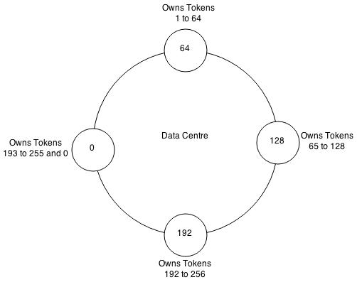

# Cassandra Workshop

## Objectives of this session
- Understand key concepts and core architect of Cassandra
- Know how to use Cassandra to solve simple use cases.

## Setup Environment

Download and install Docker if you haven't: `https://www.docker.com/`

After that, run this command on your computer to install Cassandra docker image: 
```
docker run --name demo -d cassandra:latest
```

Open two terminal, in the first terminal, run the following command to run CQLSH inside the docker machine

```
docker exec -it cassandra-workshop /bin/bash
cqlsh -u cassandra -p cassandra localhost 9042
```

In the second terminal, run the following command to explore the file structures

```
docker exec -it cassandra-workshop /bin/bash
cd /var/lib/cassandra/data
```

## Key concepts

The Cassandra data model consists of keyspaces (analogous to databases), column families (analogous to tables in the relational model), keys and columns.


### Practice

```
CREATE KEYSPACE ks1 WITH replication={'class':'SimpleStrategy','replication_factor':1};
USE ks1;

CREATE TABLE user_tracking (
  user_id text,
  action_category text,
  action_id text,
  action_detail text,

  PRIMARY KEY(user_id, action_category, action_id)
);

DESC user_tracking;

INSERT INTO ks1.user_tracking(user_id, action_category, action_id,  action_detail) VALUES ('user1', 'auth', 'a1',  'Logged in from home page');

SELECT * FROM user_tracking;
SELECT * FROM user_tracking where user_id='user1';
SELECT * FROM user_tracking where user_id='user2';
```

## Data Model & CQL

CQL consists of statements. Like SQL, statements change data, look up data, store data, or change the way data is stored. Statements end in a semicolon (;).

For example, the following is valid CQL syntax:

```
SELECT * FROM MyTable;

UPDATE MyTable
  SET SomeColumn = 'Some Value'
  WHERE columnName = 'Something Else';
```

Reference for the full details: [Link](https://docs.datastax.com/en/dse/5.1/cql/cql/cql_reference/cql_commands/cqlCommandsTOC.html)

### Practice - Create

```
insert into ks1.user_tracking(user_id, action_category, action_id,  action_detail) VALUES ('user1', 'auth', 'a1',  'Logged in from home page');

insert into ks1.user_tracking(user_id, action_category, action_id,  action_detail) VALUES ('user1', 'auth', 'a2', 'Logged in from email link');
insert into ks1.user_tracking(user_id, action_category, action_id,  action_detail) VALUES ('user1', 'dashboard', 'a3', 'Opened dashboard link');
insert into ks1.user_tracking(user_id, action_category, action_id,  action_detail) VALUES ('user2', 'auth', 'a4', 'Logged in');
```

### Practice - Query

Run this query, you should see an error because action_category is not declared as the partition key
```
select * from user_tracking where action_category='auth';
```

With **Allow Filtering** enabled, Cassandra will do the query for you, but the performance is expected to be slow.
```
select * from user_tracking where action_category='auth' allow filtering;
```

### Practice - Insert and Overwrite data

When inserting new data with the same partition key, it's overwrite the data.

```
insert into ks1.user_tracking(user_id, action_category, action_id,  action_detail) VALUES ('user2', 'auth', 'a4', 'Logged in 3');
```

### Practice - Update

This command will cause error because you can't update the "keys" column.

```
update ks1.user_tracking set action_id = 'a0' where user_id='user1' and action_category='auth';
```

### Practice - Delete

```
delete from ks1.user_tracking where user_id='user1' and action_category='auth';
```

### Practice - Clustering Key

Clustering key are being used to sort the data returned.

```
CREATE TABLE user_tracking_ordered (
  user_id text,
  action_category text,
  action_id text,
  action_detail text,

  PRIMARY KEY(user_id, action_id)
) WITH CLUSTERING ORDER BY (action_id DESC); 
 
insert into ks1.user_tracking_ordered(user_id, action_category, action_id,  action_detail) VALUES ('user1', 'auth', 'a1', 'Logged in');
insert into ks1.user_tracking_ordered(user_id, action_category, action_id,  action_detail) VALUES ('user1', 'auth', 'a2', 'Logged in');
insert into ks1.user_tracking_ordered(user_id, action_category, action_id,  action_detail) VALUES ('user1', 'auth', 'a3', 'Logged in');
insert into ks1.user_tracking_ordered(user_id, action_category, action_id,  action_detail) VALUES ('user1', 'auth', 'a4', 'Logged in');
insert into ks1.user_tracking_ordered(user_id, action_category, action_id,  action_detail) VALUES ('user1', 'auth', 'a5', 'Logged in');
```

### Practice - Composite partition key
```
CREATE TABLE ut (
  user_id text,
  action_category text,
  action_id text,
  reason text,

  PRIMARY KEY((user_id, action_category), action_id)
) WITH CLUSTERING ORDER BY (action_id DESC); 
```

After we run the following inserts, what will happen?

```
insert into ks1.ut(user_id, action_category, action_id,  reason) VALUES ('user1', 'auth', 'a5', 'Logged in');
insert into ks1.ut(user_id, action_category, action_id,  reason) VALUES ('user2', 'auth', 'a3', 'Logged in');

insert into ks1.ut(user_id, action_category, action_id,  reason) VALUES 
('user2', 'auth', 'a3', 'Logged in2');

insert into ks1.ut(user_id, action_category, action_id,  reason) VALUES 
('user2', 'auth', 'a4', 'Logged in3');
```


## Exercise 1 (30 mins)

Design the table to store invoice information:
- invoice_id
- product_id
- amount
- date
- customer

Requirement
- Generate random data to inject into your table: [generatedata.com](generatedata.com)
- Run the query to get one invoice using its id
- Run the query to update the amount of one specific invoice id
- Run the query to delete one specific invoice_id
- How to query all the invoice by customer?

## How Data is stored

For each column family, don’t think of a relational table. Instead, think of a nested sorted map data structure. A nested sorted map is a more accurate analogy than a relational table, and will help you make the right decisions about your Cassandra data model.


Behind the scene, Cassandra used a file format named SSTable (Sorted String Table) which was developed by Google.

SSTables are immutable, not written to again after the memtable is flushed.

### Practice - Create and Select

Start to generate new keyspaces and tables and observe how the file structure are changes

```
CREATE KEYSPACE ks2 WITH replication={'class':'SimpleStrategy','replication_factor':1};

CREATE TABLE user_tracking_2 (
  user_id text,
  action_category text,
  action_id text,
  action_detail text,

  PRIMARY KEY(user_id, action_category, action_id)
);

insert into user_tracking_2(user_id, action_category, action_id,  action_detail) VALUES ('user1', 'auth', 'a1',  'Logged in from home page');
```

Run the following command to see the folder structure after running the table and insert

```
nodetool flush
nodetool compact
sstabledump <database file>
```

### Practice - Insert and Overwrite data

```
insert into user_tracking_2(user_id, action_category, action_id,  action_detail) VALUES ('user2', 'auth', 'a5', 'Logged in');
```


### Practice - Update

```
update ks1.user_tracking set action_id = 'a5' where user_id='user1' and action_category='auth';
```

### Practice - Delete

```
delete from ks1.user_tracking where user_id='user1' and action_category='auth';
```

**Notes:** The delete/update mechanism of Cassandra work similar to insert, it'll add a new entry with empty data to the table. The data will be compiled using ***compact*** mechanism. This is also the reason why Cassandra is good for insert, okay with reads, and not really good with update/delete. Especially if your table need to update/delete a lot, then definitely don't use Cassandra.

### Secondary Index

With the same structure defined above, this command will fail

```
select * from user_tracking where action_id='a3'
```

Now, try to create index and run the command again

```
create index on user_tracking (action_id);
select * from user_tracking where action_id='a3'
```

***Notes***: These indexes are stored locally on each node in a hidden table and built in a background process. If a secondary index is used in a query that is not restricted to a particular partition key, the query will have prohibitive read latency because all nodes will be queried. 

Reference: [Link](https://docs.datastax.com/en/archived/cassandra/3.0/cassandra/dml/dmlIndexInternals.html)

## Data Replication

### Cassandra ring architecture


At start up each node is assigned a token range which determines its position in the cluster and the rage of data stored by the node. Each node receives a proportionate range of the token ranges to ensure that data is spread evenly across the ring. 

The figure above illustrates dividing a 0 to 255 token range evenly amongst a four node cluster. Each node is assigned a token and is responsible for token values from the previous token (exclusive) to the node's token (inclusive). 

Each node in a Cassandra cluster is responsible for a certain set of data which is determined by the partitioner. A partitioner is a hash function for computing the resultant token for a particular row key. This token is then used to determine the node which will store the first replica. 

### Partition key
The purpose of partition key is to identify the partition or node in the cluster which stores that row. When data is read or write from the cluster a function called Partitioner is used to compute the hash value of the partition key. This hash value is used to determine the node/partition which contains that row. 

Cassandra offers the following partitioners:
- **Murmur3Partitioner (default)**: uniformly distributes data across the cluster based on MurmurHash hash values.
- **RandomPartitioner**: uniformly distributes data across the cluster based on MD5 hash values.
- **ByteOrderedPartitioner**: keeps an ordered distribution of data lexically by key bytes

### Replication Strategies
Cassandra stores data replicas on multiple nodes to ensure reliability and fault tolerance. The total number of replicas for a keyspace across a Cassandra cluster is referred to as the keyspace's replication factor. 

A replication factor of two means there are two copies of each row, where each copy is on a different node. 

All replicas are equally important; there is no primary or master replica.

Two replication strategies are available:
- **SimpleStrategy**: Use for a single data center only. If you ever intend more than one data center, use the NetworkTopologyStrategy
- **NetworkTopologyStrategy**: Highly recommended for most deployments because it is much easier to expand to multiple data centers when required by future expansion, it specifies how many replicas you want in each data center

### Turnable Consistency
Cassandra is **eventual consistency**

#### **Write levels**

| Level  | Description | Usage |
|---|---|---|
| ALL  |  A write must be written to the commit log and memory table on all replica nodes in the cluster for that row. |  Provides the highest consistency and the lowest availability of any other level. |
| ONE	| A write must be written to the commit log and memory table of at least one replica node.	| Satisfies the needs of most users because consistency requirements are not stringent. The replica node closest to the coordinator node that received the request serves the request| 
| QUORUM| 	A write must be written to the commit log and memtable on a quorum of replica nodes across all datacenters.	| Used in either single or multiple datacenter clusters to maintain strong consistency across the cluster. Use if you can tolerate some level of failure.| 
| ANY  | A write must be written to at least one node. If all replica nodes for the given row key are down, the write can still succeed after a hinted handoff has been written. If all replica nodes are down at write time, an ANY write is not readable until the replica nodes for that row have recovered.  | Provides low latency and a guarantee that a write never fails. Delivers the lowest consistency and highest availability compared to other levels.  |


#### **Read levels**
| Level  | Description | Usage |
|---|---|---|
| ALL	| Returns the record with the most recent timestamp after all replicas have responded. The read operation will fail if a replica does not respond.	| Provides the highest consistency of all levels and the lowest availability of all levels.| 
| ONE	| Returns a response from the closest replica, as determined by the snitch. By default, a read repair runs in the background to make the other replicas consistent.	|Provides the highest availability of all the levels if you can tolerate a comparatively high probability of stale data being read. The replicas contacted for reads may not always have the most recent write.| 
| TWO	| Returns the most recent data from two of the closest replicas.	| Similar to ONE.| 
| THREE	| Returns the most recent data from three of the closest replicas.	| Similar to TWO.| 
| QUORUM	| Returns the record with the most recent timestamp after a quorum of replicas has responded regardless of data center.	| Ensures strong consistency if you can tolerate some level of failure.| 

#### About QUORUM Level
The QUORUM level writes to the number of nodes that make up a quorum. A quorum is calculated, and then rounded down to a whole number, as follows:

`(sum_of_replication_factors / 2) + 1`

The sum of all the replication_factor settings for each data center is the sum_of_replication_factors.

If consistency is top priority, you can ensure that a read always reflects the most recent write by using the following formula:

`(nodes_written + nodes_read) > replication_factor`

For example, if your application is using the QUORUM consistency level for both write and read operations and you are using a replication factor of 3, then this ensures that 2 nodes are always written and 2 nodes are always read. The combination of nodes written and read (4) being greater than the replication factor (3) ensures strong read consistency.

## Read and write flow

### Cluster level interaction for a write and read operation.


- The node that a client connects to is designated as the coordinator. The coordinators is responsible for satisfying the clients request.
- The consistency level determines the number of nodes that the coordinator needs to hear from in order to notify the client of a successful mutation.
- Based on the partition key and the replication strategy used the coordinator forwards the mutation to all applicable nodes.

### Write operation at the nodes level


Each node processes the request individually. Every node first writes the mutation to the commit log and then writes the mutation to the memtable. Writing to the commit log ensures durability of the write as the memtable is an in-memory structure and is only written to disk when the memtable is flushed to disk. 

A memtable is flushed to disk when:
- It reaches its maximum allocated size in memory
- The number of minutes a memtable can stay in memory elapses
- Manually flushed by a user

A memtable is flushed to an immutable structure called SSTable (Sorted String Table). The commit log is used for playback purposes in case data from the memtable is lost due to node failure. 

Every SSTable creates three files on disk which include a bloom filter, a key index and a data file. Over a period of time a number of SSTables are created. This results in the need to read multiple SSTables to satisfy a read request. 

**Compaction** is the process of combining SSTables so that related data can be found in a single SSTable. This helps with making reads much faster.

### Node level read operation


Every Column Family stores data in a number of SSTables. Thus Data for a particular row can be located in a number of SSTables and the memtable. Thus for every read request Cassandra needs to read data from all applicable SSTables ( all SSTables for a column family) and scan the memtable for applicable data fragments. This data is then merged and returned to the coordinator.

### SSTable read path


Every SSTable has an associated bloom filter which enables it to quickly ascertain if data for the requested row key exists on the corresponding SSTable. This reduces IO when performing an row key lookup. 

A bloom filter is always held in memory since the whole purpose is to save disk IO. Cassandra also keeps a copy of the bloom filter on disk which enables it to recreate the bloom filter in memory quickly .  

## Data Caching

There are two layers of cache:
- Partition key cache
- Row cache


One read operation hits the row cache, returning the requested row without a disk seek. The other read operation requests a row that is not present in the row cache but is present in the partition key cache. After accessing the row in the SSTable, the system returns the data and populates the row cache with this read operation.

## Lightweight Transactions
While durable transactions with eventual/tunable consistency is quite satisfactory for many use cases, situations do arise where more is needed. Lightweight transactions, also known as compare and set, that use linearizable consistency can probably fulfill those needs.

For example, if a user wants to ensure an insert they are about to make into a new accounts table is unique for a new customer, they would use the IF NOT EXISTS clause:

```
INSERT INTO customer_account (customerID, customer_email)
    VALUES (‘LauraS’, ‘lauras@gmail.com’)
    IF NOT EXISTS;
```

## Summary

### Ideal use cases for Cassandra
- Writes exceed reads by a large margin.
- Data is rarely updated and when updates are made they are idempotent.
- Read Access is by a known primary key.
- Data can be partitioned via a key that allows the database to be spread evenly across multiple nodes.
- There is no need for joins or aggregates.

### Wrong use cases for Cassandra
- Tables have multiple access paths. Example: lots of secondary indexes.
- The application depends on identifying rows with sequential values. MySQL autoincrement or Oracle sequences.
- Aggregates: Cassandra does not support aggregates, if you need to do a lot of them, think another database.
- Joins: You many be able to data model yourself out of this one, but take care.
- Locks: Honestly, Cassandra does not support locking. There is a good reason for this. Don’t try to implement them yourself. I have seen the end result of people trying to do locks using Cassandra and the results were not pretty.
- Updates: Cassandra is very good at writes, okay with reads. Updates and deletes are implemented as special cases of writes and that has consequences that are not immediately obvious.
- Transactions: CQL has no begin/commit transaction syntax. If you think you need it then Cassandra is a poor choice for you. 

---
## References

- https://links.grokking.org/tags/119/cassandra


